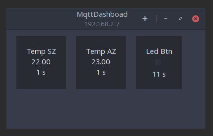

MqttDashboard
======

Simple MqttDashboard for Linux using GTK and Python

Config
------

`cp config/config.py.example` to `config/config.py` and change the values according to your setup

Dependencies
------------

GTK, `python-paho-mqtt`

Run
---

`python main.py`

